# Project 3 - 'Rateify'

Rateify is a full-stack MERN (MongoDB, Express, React, Node) application based around the idea of users reviewing and discovering music. Users can browse through the albums and singles added by other users, or add their own. I made this as my third project for General Assembly's Software Engineering Immersive course, as part of a group with **[JT Black](https://github.com/JT-Black/)** and **[Omar Al-Saena](https://github.com/omaralsanea)**. This project was my introduction to building an API.

**Duration** - 7 days

**[Link](https://rateify.netlify.app/)**

## Technologies Used

**Front End** - HTML, CSS, JavaScript, React.js, Bulma, SASS

**Back End** - Node.js, Express, MongoDB, Mongoose, JSON Web Token (JWT)

**Development** - Excalidraw, Git, GitHub, Postman, NPM, Netlify, Heroku, Trello

## The Brief

- Build a full-stack application by making a back-end and a front-end.
- Use an Express API to serve your data from a Mongo database.
- Consume your API with a separate front-end built with React. 
- Be a complete product with multiple relationships and CRUD functionality.
- Be deployed online so it’s publicly accessible.

## Development Process

After deciding on a concept we were all interested in, we started by planning out the app in Excalidraw.

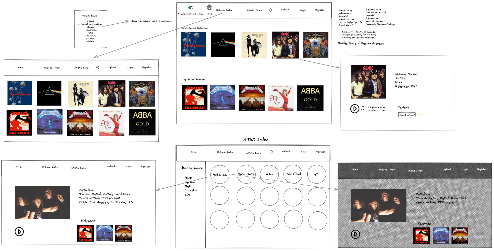

After this, we put together a rough to-do list in Trello, with certain tasks marked as 'stretch goals', meaning tasks we didn't consider essential for our MVP (Minimum Viable Product).

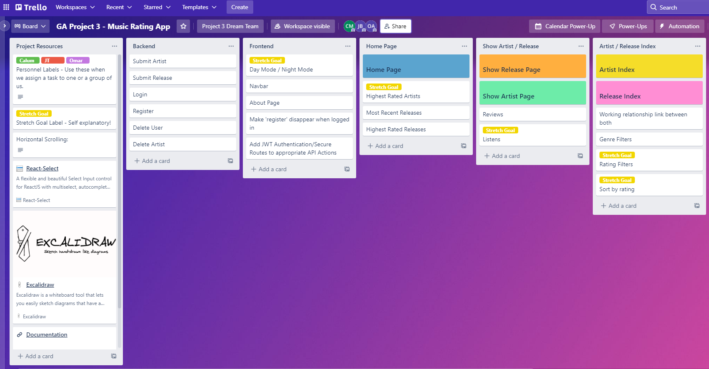

We knew that we wanted to populate the app with a decent amount of seed data, so when it was deployed there was enough there for the app to feel 'alive'. Before we even started coding, we decided that whenever any of us had spare time, we should try put together seed data in a shared Google Sheet. We used a `join()` in the Google Sheet to get this data into a form that could easily be copied and pasted into our code.

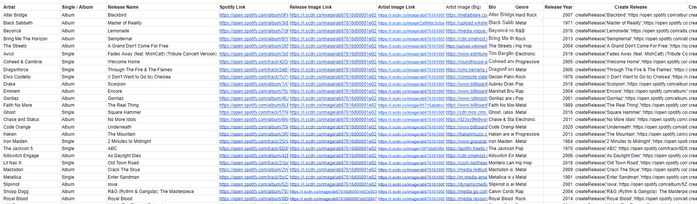

We mostly worked together using the VSCode extension Live Share. When splitting up to do work individually, we would make git branches and merge them together once the work was complete.

## App Overview

The screenshot below shows the home page of the app.

From there, if you click on one of the releases shown on the front page, you will be taken to its individual Release page.

From there, you can click on the artist's name, and be taken to their Artist page.

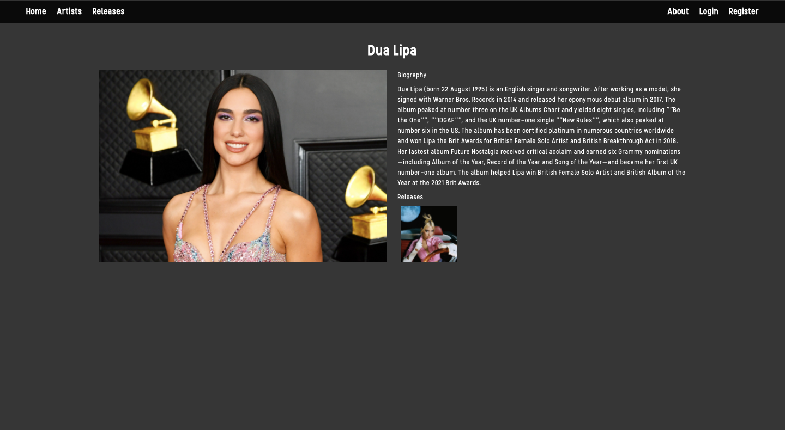

There are also pages that show all releases and all artists, accessible from the Navbar

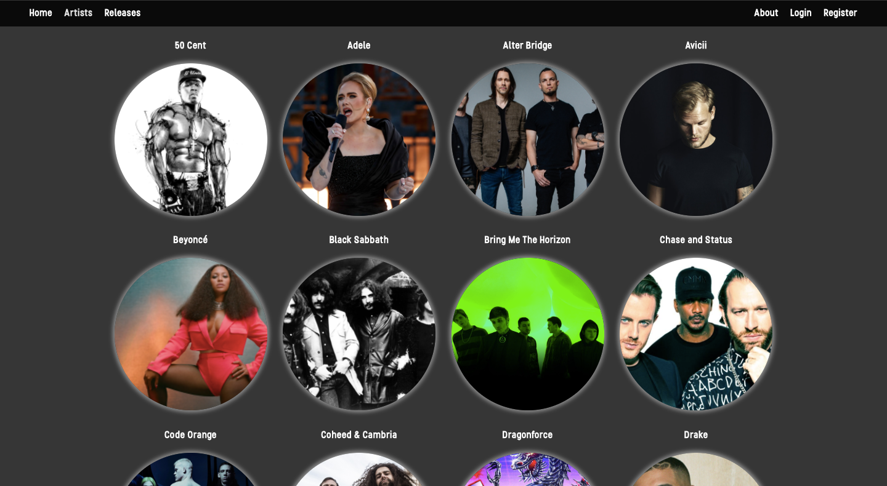

## Technical Overview

### Backend

I spent the first few days of development on the backend, building the models and controllers for users, artists, releases and reviews. See the screenshot below for the Release Schema. 

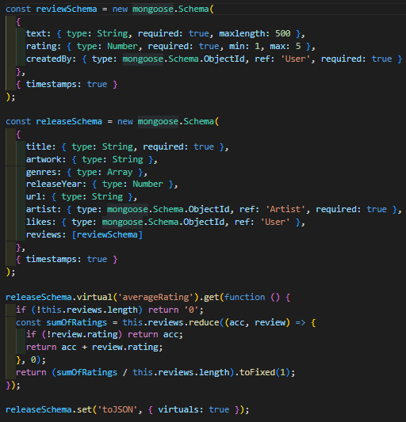

We built in a many to one relationship between the Release and Artists, as well as adding a virtual, which calculates the average rating, based on all the reviews/ratings added to the release.

For the controllers, we built in the basic CRUD (Create, Read, Update, Destroy) Operations into our controllers.

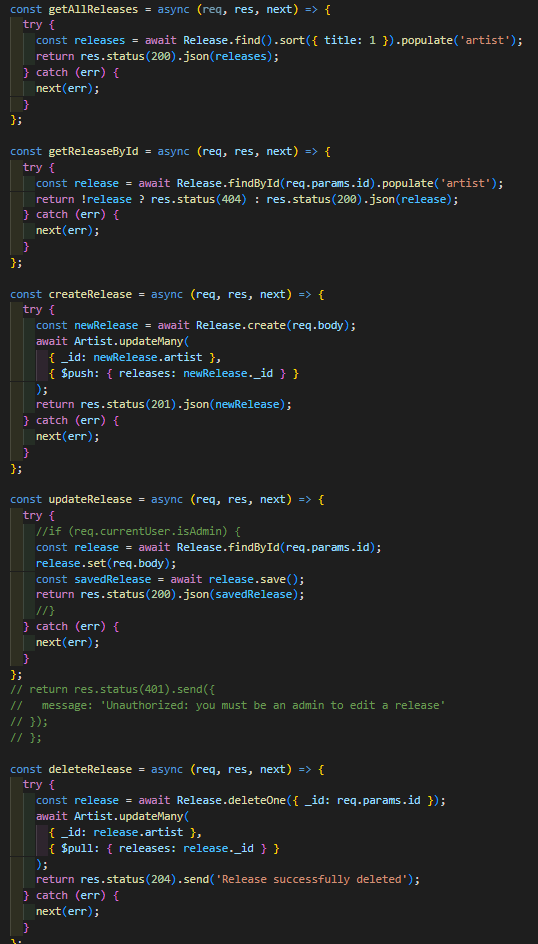

After building the Models and Controllers, we set up the router to access the data via the controllers.

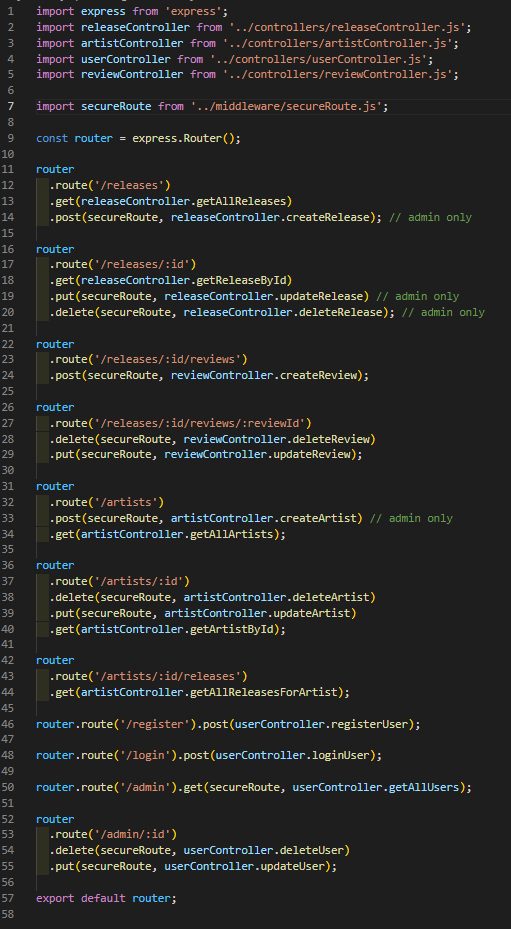

### Frontend

Once we were happy with the backend, we focused on building the frontend. The first step was to create functions that could access the data from the API, using Axios.

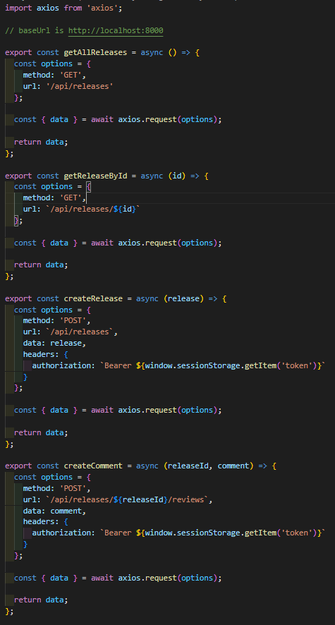  

After that, we started building the components of the frontend. We had a main components folder, and a few subfolders separate for Artist pages and Release pages, to keep things tidier.

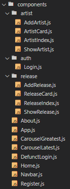

One of the components I worked on was the Add Release page. I built a form for the user to input information, using the external library **React Select** for the Genres, which allowed users to select multiple genres for the same release.

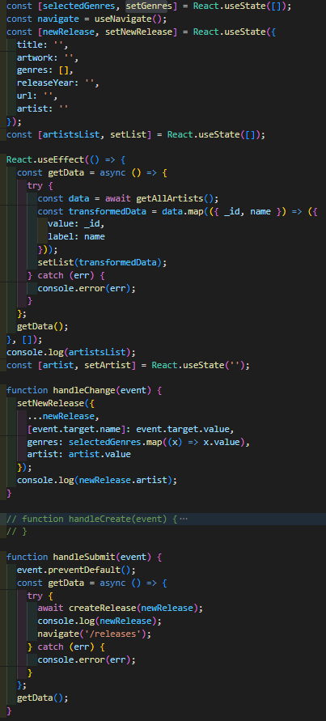

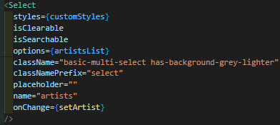

Another page that I worked a lot on was the front page of the app. This utilised 

## Design Notes

This app uses the CSS framework Bulma as the basis for its styling, with some CSS written on top of it. One of our goals in our original whiteboard was to have a toggle for day mode and night mode, but we unfortunately ran out of time to implement this. 

Quite a lot of time was spent on the visual style of the app, adjusting margins and shades to get the exact style we were after. It was important to us to have quite a minimalist visual style, as we knew we would be dealing with pictures of artists and albums that could clash with the visual style we chose to implement. 

## Known bugs, other issues, and scope for improvement.

There are no major bugs that I'm aware of. We faced a few challenges while developing, especially in relation to using some external libraries such as React-Select and React Slick. While we were able to overcome these challenges, the time spent on that meant that we didn't have time to reach some of the stretch goals we had set out, such as being able to filter and sort the Releases page by rating.

## Wins and Key Learnings

One of the big wins from this project was the collaboration between JT, Omar and I. I felt we gelled really well as a group and were very effective at communicating throughout the whole project.

Probably the most important thing I learned through the course of this project was the strengths and drawbacks of MongoDB / Document-Oriented Databases. This was cemented when moving on to the next project, which utilised a Relational Database.

